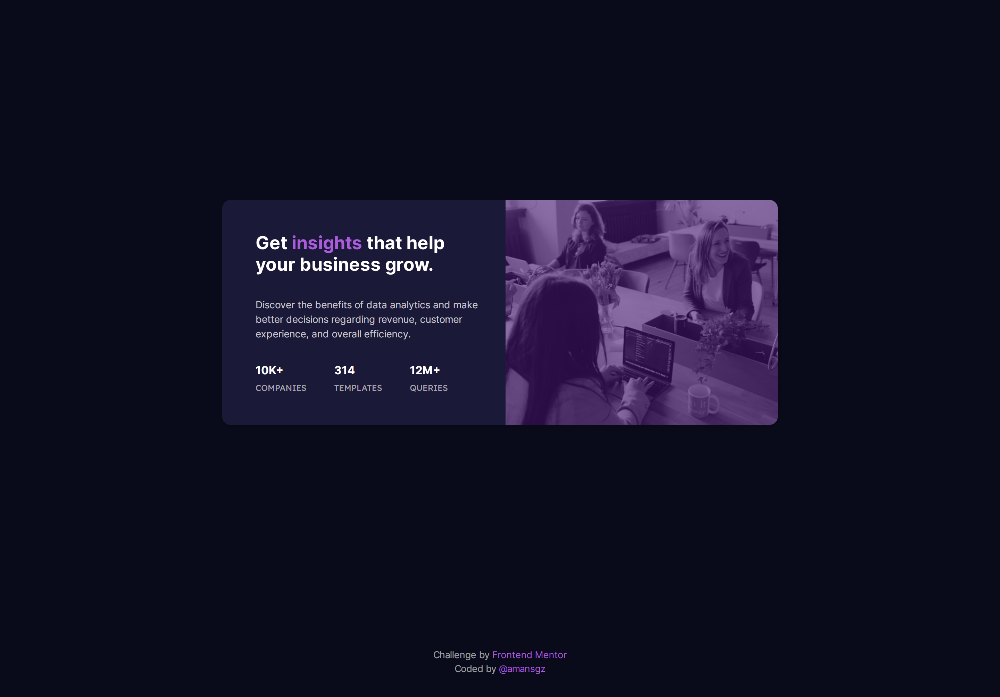

# 👩‍💻 Frontend Mentor - Stats preview card component

[Frontend Mentor challenges](https://www.frontendmentor.io/) help you improve your coding skills by building realistic projects.

This is a solution for [Stats Preview Card Component](https://www.frontendmentor.io/challenges/stats-preview-card-component-8JqbgoU62) challenge.

## The challenge

The challenge is to build out this card component and get it looking as close to the design as possible.

Users should be able to:

- View the optimal layout depending on their device's screen size

## Built with

- Semantic HTML5 markup
- CSS custom properties
- Flexbox
- Mobile-first workflow

## Live site solution

[Live site](https://amansgz.github.io/css-stats-preview-card-component/) deployed with GitHub Pages.

## Author

- Frontend Mentor - [@amansgz](https://www.frontendmentor.io/profile/amansgz)